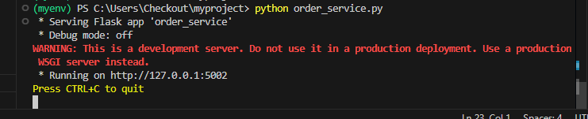
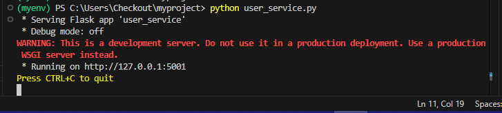
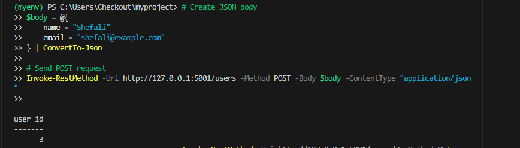
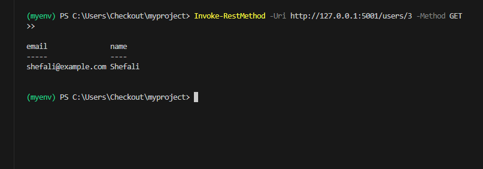
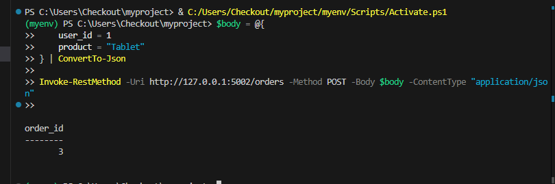
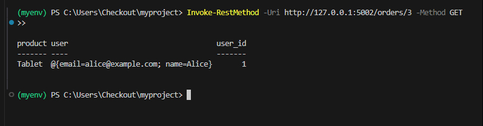

**Microservices Architecture Assignment**
-----

This project illustrates a microservices architecture using Flask with 2 services : order and user.
Create a python virtual environment, install Flask and Requests and run the 2 services independently.

- ***User Service***: Manages user data.
- ***Order Service***: Manages orders and calls the User Service.
  
**Prerequisites**
---

***Create a virtual environment***

python -m venv myenv

***Activate virtual environment on windows***

myenv\Scripts\activate

***Install Flask***

pip install flask requests

**Output**
--

***Both the services running on different ports independently.***

***Creating a User***

***Getting a User***

***Creating an Order***

***Getting an Order***

